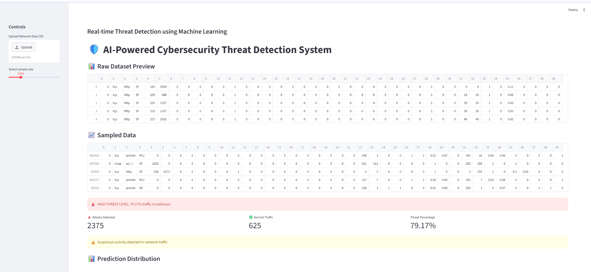
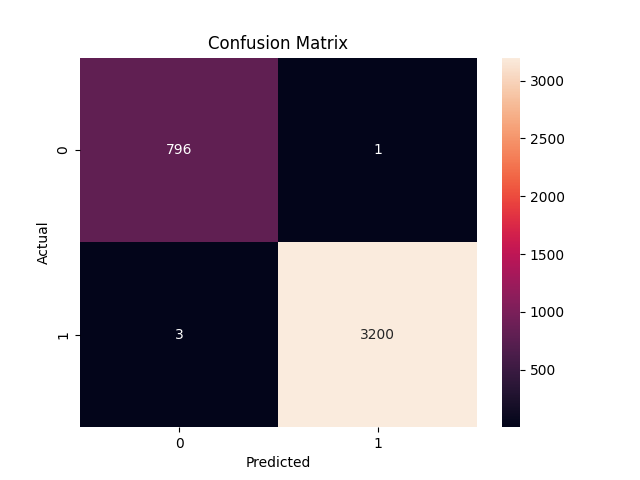
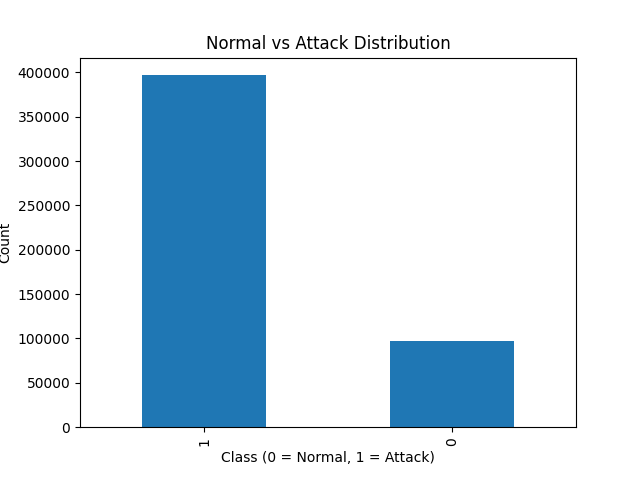
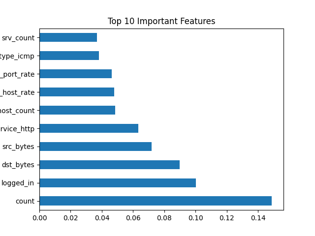

# 🛡️ AI-Powered Cybersecurity Threat Detection System

## 🚀 Overview

This project is an AI-driven cybersecurity system that detects malicious network activity using machine learning techniques. It simulates a real-world Security Operations Center (SOC) by combining threat classification, anomaly detection, and an interactive dashboard for monitoring.

---

## 🎯 Problem Statement

Traditional rule-based security systems struggle to detect evolving and unknown cyber threats. This project addresses that by:

* Identifying known attack patterns using supervised learning
* Detecting unknown anomalies using unsupervised learning
* Providing real-time monitoring and alerting through a dashboard

---

## 🧠 Key Features

* 🔍 Threat Detection using **Random Forest**
* 🚨 Anomaly Detection using **Isolation Forest**
* 📊 Confusion Matrix & Feature Importance Analysis
* 📈 Attack vs Normal Traffic Visualization
* 🖥️ Interactive Streamlit Dashboard
* 📂 Upload Custom Network Data (CSV)
* ⚠️ Threat Level Classification (Low / Medium / High)
* 📊 Real-time Malicious Traffic Percentage

---

## 🏗️ System Architecture

```
Dataset → Preprocessing → Feature Engineering → Model Training
        → Prediction → Threat Detection → Dashboard Visualization
```

---

## 📊 Dataset

* **KDD Cup 1999 Dataset**
* Contains labeled network traffic data with multiple attack categories
* Highly imbalanced dataset (dominant attack samples)

---

## ⚙️ Tech Stack

* Python
* Pandas, NumPy
* Scikit-learn
* Matplotlib, Seaborn
* Streamlit

---

## 📁 Project Structure

```
AI-Cybersecurity-Threat-Detection/
│
├── data/                # Dataset files
├── src/                 # Source code (preprocessing, training, prediction)
├── models/              # Saved ML models
├── outputs/             # Results and generated graphs
├── images/              # Screenshots for README
├── app.py               # Streamlit dashboard
├── main.py              # Model pipeline execution
├── requirements.txt
└── README.md
```

---

## ▶️ How to Run

### 1. Clone Repository

```
git clone https://github.com/varda24/AI-Cybersecurity-Threat-Detection
cd AI-Cybersecurity-Threat-Detection
```

### 2. Install Dependencies

```
pip install -r requirements.txt
```

### 3. Run Dashboard

```
streamlit run app.py
```

---

## 📊 Results & Performance

* ✔ Accuracy: ~99% (due to dataset characteristics)
* ✔ Low false positives and false negatives
* ✔ Effective detection of known and anomalous threats

> ⚠️ Note: The dataset is imbalanced, so results may appear overly optimistic compared to real-world scenarios.

---

## 🚨 Threat Detection Output

* Displays attack vs normal traffic count
* Shows percentage of malicious activity
* Generates real-time alerts (Low / Medium / High)
* Simulates SOC-style monitoring system

---

## 🖥️ Dashboard Preview

| Dashboard                          | Confusion Matrix                          |
| ---------------------------------- | ----------------------------------------- |
|  |  |

| Distribution                                   | Feature Importance                         |
| ---------------------------------------------- | ------------------------------------------ |
|  |  |

---

## 📚 Learning Outcomes

* Applied Machine Learning in Cybersecurity domain
* Built anomaly detection system for unknown threats
* Performed feature engineering on network traffic data
* Developed interactive dashboard using Streamlit
* Implemented end-to-end ML pipeline

---

## 🔮 Future Improvements

* Real-time network traffic streaming
* Deep learning models (LSTM, Autoencoders)
* Cloud deployment (AWS / Streamlit Cloud)
* REST API integration

---

## 👩‍💻 Author

**Varda**
CSE (AI/ML) Student


⚠️ Note: Dataset is not included due to size constraints.  
Download it from: http://kdd.ics.uci.edu/databases/kddcup99/kddcup99.html